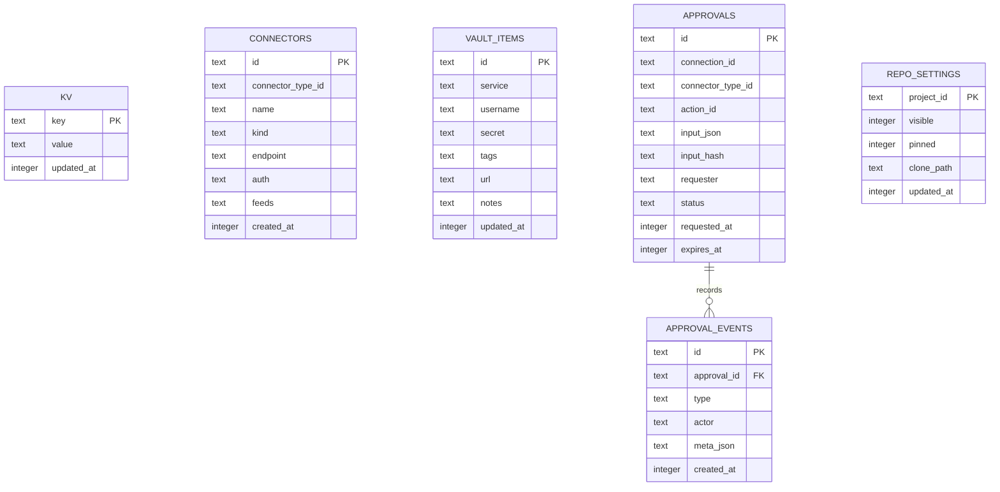
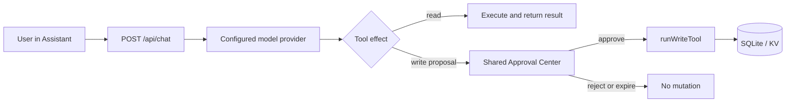

# ⛯ Arquitectura de Lintaya

[English](ARCHITECTURE.md) | Español

Lintaya es un espacio de trabajo local-first servido por un proceso pequeño de
Node.js. Reúne información de sistemas configurados en una PWA de navegador y
expone una API HTTP protegida para la UI, CLI y futuros agentes aprobados.

## Forma de ejecución

| Capa | Responsabilidad |
|---|---|
| PWA de navegador | Vistas React, navegación, ingreso de token, dashboards y configuración de conectores. |
| Servidor Node.js | API Express, autorización, rutas de conectores, migraciones y coordinación de fondo. |
| Almacén KV SQLite | Estado local, configuración pública de conectores, datos sincronizados en cache y auditoría. |
| Paquetes de conectores | Manifiestos, schemas, clientes de proveedor, modelos normalizados y rutas de ciclo de vida. |
| Secret Store | Separa secretos de conectores de configuración pública. |
| CLI | Cliente HTTP multiplataforma; lee y, mediante `api post/put/delete`, escribe. No abre SQLite ni lee secretos de conectores. |

## Estructura del repositorio

El repositorio público está organizado por responsabilidad de ejecución y no
solo por funcionalidad:

```text
Lintaya.html                 Browser entry point and script load order
app/                         PWA views and client-side API helpers
server/
  app.js                     Express app factory and authentication
  server.js                  Runtime composition and route registration
  core/                      Database, migrations, actions, logging, and services
  routes/                    Domain HTTP routes
  connectors/community/      Public connector packages
  connectors/sdk/             Connector SDK and shared test harness
cli/                         Command-line HTTP client
docs/                        User, contributor, architecture, and release docs
scripts/                     Repository checks and release validation
vendor/                      Locally vendored browser dependencies
assets/                      Public brand and social assets
```

`server/` es el límite de ejecución: el navegador, la CLI y los agentes usan
su API HTTP, mientras solo el servidor abre SQLite y el Secret Store. Los
paquetes de conectores se cargan desde el directorio community incluido y,
opcionalmente, desde `LINTAYA_CONNECTORS_DIR`; no se convierten en código del
frontend.

## Persistencia en SQLite

Lintaya usa dos bases SQLite locales. La base principal se abre con las
migraciones versionadas de `server/core/database.js`; la configuración de
repositorios usa una base y una lista de migraciones separadas desde
`server/routes/repos.js`. Ambas usan modo WAL y son estado local del runtime,
no archivos para subir al repositorio ni copiar mientras están activas.



La mayoría del estado del producto se guarda intencionalmente como valores
JSON en `kv`, con prefijos estables como `connector-config-<id>`,
`connector-data-<id>`, `dashboards`, `custom-blocks` o
`activity-log-<domain>`. El diagrama muestra las tablas físicas; los registros
lógicos dentro de `kv` están documentados por las rutas y servicios dueños de
cada clave. Los secretos de conectores no se guardan en la configuración
pública y deben manejarse mediante el Secret Store.

No existe paso de build para el frontend. Lintaya.html carga app/*.jsx como
scripts Babel en el navegador. Cada script tiene su propio scope y expone su
vista mediante window; el shell en app/app.jsx se carga al final.

### Librerías de frontend

Cada script de terceros que carga Lintaya.html está vendorizado localmente en
vendor/ en lugar de traerse de un CDN, para que la PWA siga funcionando sin
acceso a internet. Ver NOTICE para sus licencias.

| Librería | Versión | Propósito |
|---|---|---|
| React / React DOM | 18.3.1 | Runtime de UI |
| Babel Standalone | 7.29.0 | Transpilación de JSX en el navegador |
| Marked | 12.0.2 | Render de Markdown |
| Mermaid | 10.9.1 | Render de diagramas Mermaid |
| DOMPurify | 3.1.6 | Sanitiza los blocks "content" de Block Builder antes de dangerouslySetInnerHTML |

## Límites principales

Todas las rutas API excepto health y AI context requieren un token Bearer. El
servidor valida configuración al iniciar y conserva la ruta HTML catch-all al
final, después de cada ruta API.

El estado se guarda mediante migraciones SQLite versionadas y los helpers KV en
server/core. Los archivos de base local no son archivos de configuración
portables: usa el flujo de respaldo cifrado en lugar de copiar una base activa y
sus archivos WAL.

El Secret Store ofrece compatibilidad legacy, cifrado local y modos respaldados
por Bitwarden. Respuestas de proveedor, archivos importados, repositorios y logs
son entrada no confiable. Los secretos no deben aparecer en respuestas,
diagnósticos ni logs.

## Modelo de conectores

Un ConnectorType es una integración de producto registrada por su manifiesto,
como GitLab o vCenter. Posee identidad estable, metadata, capacidades, schemas e
implementación.

Una Connection es una instancia configurada de ese tipo, como un servidor GitLab
particular. Posee nombre, estado de ciclo de vida, configuración pública,
referencias de secretos, estado, datos sincronizados y actividad. Los IDs de
rutas existentes conservan compatibilidad mientras metadata de conexiones migra
hacia la tabla connectors.

| Concepto | Ejemplos | Propiedad |
|---|---|---|
| ConnectorType | gitlab, github, vcenter | Registry y manifiesto. |
| Connection | gitlab, gitlab2 | Instancia configurada y datos locales. |
| Bloque | gitlab.recent-commits | Contenido reutilizable de dashboard desde una conexión. |
| Tablero | Página de Module Builder | Layout compuesto por usuario que posee colocaciones y tamaños de Bloques. |
| Dashboard | Referencias ordenadas a Tableros | Solo metadata de contenedor; nunca posee ni copia árboles de Tablero. |
| Binding | Colocación de tablero a bloque | Relación de layout, no datos de proveedor. |

Lee [ADR-010](docs/adr/010-connector-type-vs-connection.es.md) y
[ADR-012](docs/adr/012-canonical-dashboard-pages-blocks-bindings.es.md) para
la justificación de migración y compromisos de compatibilidad.

## Páginas y módulos

Cada página es una vista React elegida por ruta en `app/app.jsx`. Una página
proviene de uno de tres lugares, y la diferencia importa al decidir dónde va un
cambio.

**El código de la vista siempre vive en `app/`.** Un conector nunca aporta un
componente; declara en su manifiesto que existe un módulo, y el shell resuelve
el componente nombrado entre los ya cargados. Por eso tres conectores distintos
pueden publicar el mismo `ReposView` bajo tres rutas: la página de repositorios
es código core, y GitLab, GitHub y Bitbucket deciden cada uno que debe aparecer
para su conexión.

### Páginas core

Siempre presentes, con independencia de cualquier conexión.

| Ruta | Componente | Archivo |
|---|---|---|
| home | HomeView | app/home.jsx |
| block-catalog | BlockCatalogView | app/block-catalog.jsx |
| devices | DevicesView | app/devices.jsx |
| connectors | ConnectorsView | app/connectors.jsx |
| modules | ConnectorModulesPage | app/app.jsx |
| dashboards | DashboardCatalogView | app/dashboard.jsx |
| module-builder | ModuleBuilderView | app/module-builder.jsx |
| tags | TagsView | app/tags.jsx |
| ssh | SSHWorkspaceView | app/app.jsx |
| sshlogs | SshLogsView | app/ssh-logs.jsx |
| approvals | ApprovalCenterView | app/approvals.jsx |
| documentation | DocumentationView | app/documentation.jsx |
| settings | SettingsView | app/settings.jsx |

Ser core no significa ser autosuficiente. Home pinta Blocks publicados por
conexiones y permanece en la navegación existan o no. VMs y Hosts estaban en
esta tabla por la misma razón, pero no pintan nada que no sean datos de vCenter,
así que la Fase 1 del ADR-014 los movió a la tabla de abajo: el código de la
vista sigue viviendo en `app/`, y ahora solo la entrada del menú depende de la
conexión.

### Páginas publicadas por conectores

Declaradas por `modules[]` en el manifiesto de un conector. La página es
navegable sólo mientras haya una conexión de ese tipo configurada, conectada y
habilitada, que es lo que hace que una instalación nueva muestre una barra
lateral corta en vez de un muro de módulos vacíos.

Cada módulo declarado produce dos rutas, porque un conector puede tener más de
una conexión:

- `module:<idConexión>:<idMódulo>` — con conciencia de instancia, pintada
  genéricamente por `ConnectorModuleView` resolviendo el componente declarado.
  Una segunda cuenta de GitLab obtiene su propia ruta y nunca choca con la
  primera.
- Una **ruta core**, que sólo recibe la conexión cuyo id es igual a su tipo: la
  conexión base. Los módulos `ReposView` obtienen `repos-<tipo>`; los demás
  toman su propio id. Son las rutas cortas y estables que el shell pinta con un
  handler explícito, y la barra lateral esconde una cuando ningún conector
  publica el módulo correspondiente.

| Ruta core | id de módulo | Componente | Archivo | Publicada por |
|---|---|---|---|---|
| passwords | passwords | PasswordsView | app/passwords.jsx | bitwarden (`bw`) |
| containers | containers | ContainersView | app/containers.jsx | portainer |
| correo | correo | MailView | app/mail.jsx | outlook-local |
| calls | calls | CallsView | app/calls.jsx | outlook |
| repos-gitlab | repositories | ReposView | app/repos.jsx | gitlab |
| repos-github | repositories | ReposView | app/repos.jsx | github |
| repos-bitbucket | repositories | ReposView | app/repos.jsx | bitbucket |
| vms | vms | VMsView | app/vms.jsx | vcenter |
| hosts | hosts | HostsView | app/hosts.jsx | vcenter |

Los demás tipos de conector no publican página alguna. anthropic, outline,
plane, lintaya-remote, qportal y ucsm aportan Blocks y datos
sincronizados que consumen las páginas core y los Boards del usuario.

Qué tiers se entregan públicamente, y cómo se vuelve a agregar un conector que
no se entrega, se decide en
[ADR-014](docs/adr/014-connector-distribution-and-drop-in.es.md).

### Páginas creadas por el usuario

Los Boards y Dashboards agregan rutas en tiempo de ejecución: `page:<id>`
pintada por `CustomPageView` (app/custom-page-view.jsx) y `dashboard:<id>`
pintada por `DashboardWorkspaceView` (app/dashboard.jsx). Son datos, no código:
agregar uno no incorpora ningún archivo.

### Cabeceras de página

Nueve superficies abren con una barra de cabecera: una franja superior con el
título y los controles de la página, cerrada por un borde inferior. No son un
componente único —cada vista escribe la suya— pero todas leen la misma altura,
el token `--header-h` declarado junto al resto de tokens en `Lintaya.html`.

| Superficie | Archivo |
|---|---|
| Marca y plegado del sidebar | app/app.jsx |
| Editor de bloques | app/block-builder.jsx |
| Editor de boards | app/module-builder.jsx |
| Editor de dashboards | app/dashboard.jsx |
| Workspace de dashboard | app/dashboard.jsx |
| Panel del Assistant | app/ai-chat.jsx |
| Detalle de conector | app/connectors.jsx |
| Pestañas de Logs | app/ssh-logs.jsx |
| Pestañas de Documentación | app/documentation.jsx |

Antes deducían su altura de su propio padding y contenido, y habían derivado a
38, 44.8, 45, 55.8, 58 y 60.5 px — desalineadas allí donde se juntaban dos, que
es casi toda la app, porque el sidebar convive con cualquier página. Leer el
token las hace coincidir por construcción: una cabecera no se mueve al cambiar
su fuente o sus botones, y un solo número mueve las nueve.

El token es la altura *mínima*, así que una cabecera sigue creciendo si su
contenido lo pide. Dos lo hacen a propósito: los editores de Board y Dashboard
reparten sus botones en una segunda fila en vez de desbordar, así que añadir
controles ahí puede sacarlas de la franja. El presupuesto es 56 - 8 - 8 - 1 =
39 px de contenido, fijado por la cabecera más alta cuando se eligió.

Una página que no está en esta tabla no tiene franja: su contenido arranca
directamente con el padding de la página y no hay nada que alinear. Es el caso
de la mayoría de las páginas core.

## Ciclo de vida de conectores

Los paquetes de conectores viven bajo server/connectors. Este repositorio
entrega solo el nivel Community; los niveles Enterprise y Development se
distribuyen en su propio repositorio y se instalan fuera del árbol (ADR-014).
Un manifiesto describe el tipo; el paquete provee schema, cliente, rutas,
modelos normalizados y pruebas. Una conexión configurada
sigue el ciclo config, test y sync y aparece en connector status.

Un conector no tiene por qué vivir en este árbol. El descubrimiento también
recorre `LINTAYA_CONNECTORS_DIR` (por defecto `~/.lintaya/connectors/`), un
directorio plano fuera del repositorio donde instalar es copiar una carpeta y
desinstalar es borrarla. Un manifiesto ahí apunta a su propia carpeta en vez de
a la raíz del repositorio, declara su propio tier, y no puede reclamar un id que
ya se entrega aquí — el conector entregado nunca se reemplaza en silencio.

Un paquete así no puede resolver nada por ruta relativa fuera de su propia
carpeta, así que lo que necesita le llega en el contexto de conector que el
loader entrega a cada `register()`: el Connector SDK, `express` y los
servicios compartidos que un conector puede pedir. Es deliberado, no cómodo. El
SDK es la fachada de `core/services/connector-store` y del secret store de
proceso, así que un conector tiene que recibir la instancia del propio host —
una copia del SDK construiría un segundo store y leería secretos que el host
nunca escribió.

Un conector atado a una plataforma lo declara, y el registro lo respeta: no se
monta en ninguna otra, no se agenda, y la tarjeta dice por qué en vez de leerse
como simplemente desconectado.

Un conector puede publicar una página, pero no el código que la dibuja. Un
manifiesto nombra un componente que Lintaya ya cargó; la UI ejecutable nunca
viaja por la API. Cuando esa página es una ruta core — Passwords, Containers,
VMs, Hosts, Llamadas, Correo, Repos <proveedor> — `NAV_ROUTES` la marca como
propiedad de un conector, y aparece solo mientras algún módulo disponible la
publique. Un build que no trae vCenter no ofrece entrada de VMs.

El contrato público actual es intencionalmente conservador. El CLI lee estado,
conexiones, bloques, tableros y endpoints GET documentados. Mutaciones futuras,
herramientas MCP y acciones de equipo necesitan Action Registry, política de
aprobación y auditoría descritas en [ADR-011](docs/adr/011-connector-actions-rest-mcp.es.md).

## Agentes, CLI y equipos

El endpoint de servidor GET /api/ai-context anuncia capacidades API. Un agente
que inicia una escritura mediante API debe identificarse con X-Actor para que la
actividad auditada registre el actor. Esto no concede permisos adicionales.

### Assistant integrado y flujo de aprobación

El Assistant del navegador es un cliente local de Lintaya, no un atajo con
privilegios. Su configuración admite Anthropic, OpenAI, opencode, Ollama,
servidores compatibles con OpenAI y LiteLLM; los secretos permanecen en el
servidor. La ruta de chat enriquece el system prompt con el estado de conectores
y el AI context guardado para cada conexión. Las tools de lectura pueden
ejecutarse durante el turno del modelo, mientras que las que crean un Board,
Dashboard o Block solo presentan una propuesta.



Approval Center es el ledger compartido, no un endpoint de confirmación propio
del Assistant. Sus propuestas usan `connectorTypeId: "assistant"` y conservan
la misma huella de parámetros, caducidad, decisión de uso único y auditoría
independiente que las acciones destructivas de conectores. Los efectos siguen
separados: propuestas locales `write` ejecutan `runWriteTool()`, mientras que
acciones `destructive` aprobadas ejecutan el Action Registry.

El CLI puede guardar múltiples perfiles locales para servidores Lintaya
individuales. Un servicio Team futuro es un límite independiente de despliegue y
autorización: no debe copiar base de datos, credenciales de conectores ni estado
de filesystem local de otra persona. Consulta [ADR-013](docs/adr/013-cli-local-and-team-boundary.es.md).

## Restricciones operativas

- El acceso de red y credenciales de conector determinan datos disponibles.
- Una operación respaldada por Bitwarden necesita el vault desbloqueado después
  de cada reinicio del servidor.
- No ejecutes código de repositorio no confiable en el host; sandboxing es un
  límite planeado.
- El service worker de la PWA invalida cache al iniciar desarrollo local.
- OneDrive o carpetas de sincronización similares pueden competir con escrituras
  de archivos fuente; conserva respaldos y evita ediciones concurrentes.

## Ubicaciones clave

| Ubicación | Propósito |
|---|---|
| Lintaya.html | Entry point PWA y orden de carga JSX. |
| vendor/ | Scripts de terceros vendorizados localmente (ver Librerías de frontend arriba). |
| app/api.js | Cliente API de navegador y manejo de token. |
| app/app.jsx | Shell, navegación y composición final de vistas. |
| app/ai-chat.jsx | Panel Assistant consciente del proveedor, propuestas de tools y resize persistente. |
| server/app.js | Factory Express, autorización compartida, health y contexto API. |
| server/server.js | Composición ejecutable del servidor e integración de rutas legacy. |
| server/routes/ai-settings.js | Settings de proveedores IA, descubrimiento de modelos, contexto de prompt, tool calling y SSE de chat. |
| server/core/assistant-tools.js | Catálogo validado de tools read/write usado por Assistant y el ejecutor de aprobaciones. |
| server/core/ | Configuración, base, migraciones, errores, logs y servicios. |
| server/connectors/ | Manifiestos, vista previa SDK, paquetes y pruebas de conectores. |
| cli/ | Cliente HTTP e interfaz de terminal. |
