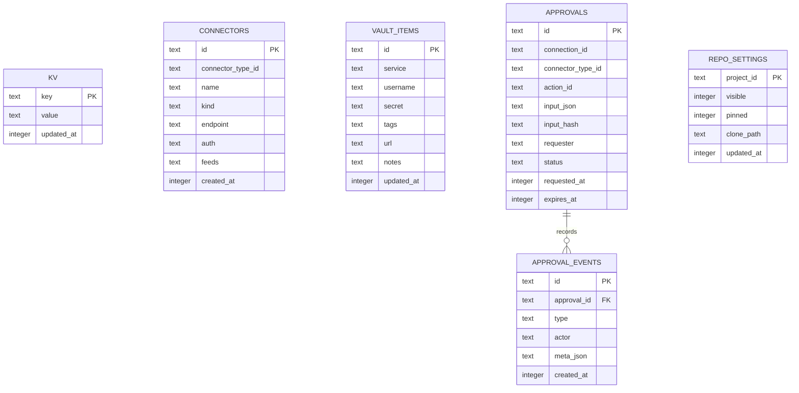
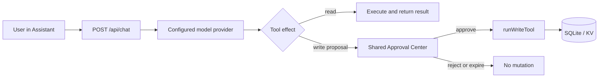

# ⛯ Lintaya architecture

English | [Español](ARCHITECTURE.es.md)

Lintaya is a local-first workspace served by a small Node.js process. It brings
information from configured systems into a browser PWA and exposes a guarded HTTP
API for the UI, CLI, and future approved agents.

## Runtime shape

| Layer | Responsibility |
|---|---|
| Browser PWA | React views, navigation, token entry, dashboards, and connector configuration. |
| Node.js server | Express API, authorization, connector routes, migrations, and background coordination. |
| SQLite KV store | Local state, connector public configuration, cached synchronized data, and audit records. |
| Connector packages | Manifests, schemas, provider clients, normalized models, and lifecycle routes. |
| Secret Store | Separates connector secrets from public configuration. |
| CLI | Cross-platform HTTP client; it reads and, through `api post/put/delete`, writes. It does not open SQLite or read connector secrets. |

## Repository structure

The public repository is organized by runtime responsibility rather than by
feature alone:

```text
Lintaya.html                 Browser entry point and script load order
app/                         PWA views and client-side API helpers
server/
  app.js                     Express app factory and authentication
  server.js                  Runtime composition and route registration
  core/                      Database, migrations, actions, logging, and services
  routes/                    Domain HTTP routes
  connectors/community/      Public connector packages
  connectors/sdk/             Connector SDK and shared test harness
cli/                         Command-line HTTP client
docs/                        User, contributor, architecture, and release docs
scripts/                     Repository checks and release validation
vendor/                      Locally vendored browser dependencies
assets/                      Public brand and social assets
```

`server/` is the runtime boundary: the browser, CLI, and agents use its HTTP
API, while only the server opens SQLite and the Secret Store. Connector
packages are loaded from the shipped community directory and, optionally,
from the external `LINTAYA_CONNECTORS_DIR`; they do not become frontend code.

## SQLite persistence

Lintaya uses two local SQLite databases. The main database is opened with the
versioned migrations in `server/core/database.js`; repository settings use a
separate database and migration list from `server/routes/repos.js`. Both use
WAL mode and are local runtime state, not files to commit or copy while live.



Most product state is intentionally stored as JSON values in `kv`, keyed by a
stable domain prefix such as `connector-config-<id>`, `connector-data-<id>`,
`dashboards`, `custom-blocks`, or `activity-log-<domain>`. The diagram shows
the physical tables; the logical records inside `kv` are documented by the
routes and services that own each key. Connector secrets are not stored in
public connector configuration and must be handled by the Secret Store.

There is no frontend build step. Lintaya.html loads app/*.jsx as browser Babel
scripts. Each script has its own scope and exposes its view through window; the
shell in app/app.jsx is loaded last.

### Frontend libraries

Every third-party script Lintaya.html loads is vendored locally under vendor/
rather than fetched from a CDN, so the PWA keeps working with no internet
access. See NOTICE for their licenses.

| Library | Version | Purpose |
|---|---|---|
| React / React DOM | 18.3.1 | UI runtime |
| Babel Standalone | 7.29.0 | In-browser JSX transpilation |
| Marked | 12.0.2 | Markdown rendering |
| Mermaid | 10.9.1 | Diagram rendering for Mermaid fences |
| DOMPurify | 3.1.6 | Sanitizes Block Builder "content" blocks before dangerouslySetInnerHTML |

## Main boundaries

All API routes other than health and AI context require a Bearer token. The
server validates configuration at startup and keeps the HTML catch-all route
last, after every API route.

State is stored through versioned SQLite migrations and the KV helpers in
server/core. Local database files are not portable configuration files: use the
encrypted backup flow rather than copying a live database and WAL files.

The Secret Store offers legacy compatibility, local encryption, and Bitwarden
backed modes. Provider responses, imported files, repositories, and logs are
untrusted input. Secrets must not appear in responses, diagnostics, or logs.

## Connector model

A ConnectorType is a product integration registered by its manifest, such as
GitLab or vCenter. It owns stable identity, metadata, capabilities, schemas, and
implementation.

A Connection is one configured instance of that type, such as a particular
GitLab server. It owns its name, lifecycle state, public configuration, secret
references, status, synchronized data, and activity. Existing route IDs remain
compatible while connection metadata is migrated toward the connectors table.

| Concept | Examples | Ownership |
|---|---|---|
| ConnectorType | gitlab, github, vcenter | Registry and manifest. |
| Connection | gitlab, gitlab2 | Configured instance and local data. |
| Block | gitlab.recent-commits | Reusable workspace content from a connection. |
| Board | Module Builder page | User-composed layout that owns Block placements and sizes. |
| Dashboard | Ordered Board references | Container metadata only; it never owns or copies Board trees. |
| Binding | board-to-block placement | Layout relationship, not provider data. |

Read [ADR-010](docs/adr/010-connector-type-vs-connection.md) and
[ADR-012](docs/adr/012-canonical-dashboard-pages-blocks-bindings.md) for the
migration rationale and compatibility commitments.

## Pages and modules

Every page is a React view chosen by route in `app/app.jsx`. A page comes from
one of three places, and the difference matters when deciding where a change
belongs.

**The view code always ships in `app/`.** A connector never supplies a
component; it declares in its manifest that a module exists, and the shell
resolves the named component from the ones already loaded. That is why three
different connectors can publish the same `ReposView` under three routes: the
repository page is core code, and GitLab, GitHub, and Bitbucket each decide that
it should appear for their connection.

### Core pages

Always present, independent of any connection.

| Route | Component | File |
|---|---|---|
| home | HomeView | app/home.jsx |
| block-catalog | BlockCatalogView | app/block-catalog.jsx |
| devices | DevicesView | app/devices.jsx |
| connectors | ConnectorsView | app/connectors.jsx |
| modules | ConnectorModulesPage | app/app.jsx |
| dashboards | DashboardCatalogView | app/dashboard.jsx |
| module-builder | ModuleBuilderView | app/module-builder.jsx |
| tags | TagsView | app/tags.jsx |
| ssh | SSHWorkspaceView | app/app.jsx |
| sshlogs | SshLogsView | app/ssh-logs.jsx |
| approvals | ApprovalCenterView | app/approvals.jsx |
| documentation | DocumentationView | app/documentation.jsx |
| settings | SettingsView | app/settings.jsx |

Being core does not mean being self-contained. Home renders Blocks published by
connections and stays in the navigation whether or not any exist. VMs and Hosts
used to sit in this table for the same reason, but they render nothing except
vCenter data, so ADR-014 Phase 1 moved them to the table below: the view code
still ships in `app/`, and only the entry in the sidebar now depends on the
connection.

### Connector-published pages

Declared by `modules[]` in a connector manifest. The page is navigable only
while a connection of that type is configured, connected, and enabled, which is
what makes a fresh installation show a short sidebar rather than a wall of empty
modules.

Each declared module produces two routes, because a connector can have more than
one connection:

- `module:<connectionId>:<moduleId>` — instance-aware, rendered generically by
  `ConnectorModuleView` resolving the declared component. A second GitLab
  account gets its own route and never collides with the first.
- A **core route**, given only to the connection whose id equals its type — the
  base connection. `ReposView` modules get `repos-<type>`; every other module
  takes its own id. These are the short, stable routes the shell renders through
  an explicit handler, and the sidebar hides one when no connector publishes the
  matching module.

| Core route | module id | Component | File | Published by |
|---|---|---|---|---|
| passwords | passwords | PasswordsView | app/passwords.jsx | bitwarden (`bw`) |
| containers | containers | ContainersView | app/containers.jsx | portainer |
| correo | correo | MailView | app/mail.jsx | outlook-local |
| calls | calls | CallsView | app/calls.jsx | outlook |
| repos-gitlab | repositories | ReposView | app/repos.jsx | gitlab |
| repos-github | repositories | ReposView | app/repos.jsx | github |
| repos-bitbucket | repositories | ReposView | app/repos.jsx | bitbucket |
| vms | vms | VMsView | app/vms.jsx | vcenter |
| hosts | hosts | HostsView | app/hosts.jsx | vcenter |

The remaining connector types publish no page at all. anthropic, outline, plane,
lintaya-remote, qportal, and ucsm contribute Blocks and synchronized data that
core pages and user Boards consume.

Which tiers ship publicly, and how a connector that is not shipped is added
back, is decided in
[ADR-014](docs/adr/014-connector-distribution-and-drop-in.md).

### User-created pages

Boards and Dashboards add routes at runtime — `page:<id>` rendered by
`CustomPageView` (app/custom-page-view.jsx) and `dashboard:<id>` rendered by
`DashboardWorkspaceView` (app/dashboard.jsx). They are data, not code: adding
one ships no file.

### Page headers

Nine surfaces open with a header rail: a bar across the top of the page carrying
its title and controls, closed by a bottom border. They are not one component —
each view writes its own — but they all read one height, the `--header-h` token
declared with the rest of the design tokens in `Lintaya.html`.

| Surface | File |
|---|---|
| Sidebar brand + collapse | app/app.jsx |
| Block editor | app/block-builder.jsx |
| Board editor | app/module-builder.jsx |
| Dashboard editor | app/dashboard.jsx |
| Dashboard workspace | app/dashboard.jsx |
| Assistant panel | app/ai-chat.jsx |
| Connector detail | app/connectors.jsx |
| Logs tabs | app/ssh-logs.jsx |
| Documentation tabs | app/documentation.jsx |

They used to derive their height from their own padding and content, and had
drifted to 38, 44.8, 45, 55.8, 58 and 60.5 px — visibly out of line wherever two
of them met, which is most of the app, since the sidebar sits beside every page.
Reading the token instead makes them agree by construction: a header stays put
when its font or its buttons change, and one number moves all nine.

The token is the *minimum* height, so a header still grows if its content
demands it. Two do that on purpose: the Board and Dashboard editors wrap their
buttons onto a second row rather than overflow, so adding controls there can
push them past the rail. The budget is 56 - 8 - 8 - 1 = 39 px of content, set
by the tallest header at the time it was chosen.

A page that is not in this table has no rail at all: its content simply starts
with the page padding, and there is nothing to line up. That is most core pages.

## Connector lifecycle

Connector packages live under server/connectors. This repository ships the
Community tier only; the Enterprise and Development tiers are distributed in
their own repository and installed outside the tree (ADR-014). A manifest
describes the type; the package supplies schema, client, routes, normalized
models, and tests. A configured connection follows
the config, test, and sync lifecycle and appears in connector status.

A connector need not live in this tree. Discovery also scans
`LINTAYA_CONNECTORS_DIR` (default `~/.lintaya/connectors/`), a flat directory
outside the repository where installing is copying a folder and removing is
deleting it. A manifest there points at its own folder rather than at the
repository root, declares its own tier, and may not claim an id that ships
here — the shipped connector is never silently replaced.

Such a package cannot resolve anything by relative path outside its own folder,
so what it needs arrives in the connector context the loader hands to every
`register()`: the Connector SDK, `express`, and the shared services a
connector may ask for. That is deliberate rather than convenient. The SDK
fronts `core/services/connector-store` and the process-wide secret store, so a
connector must receive the host's own instance — a copy of the SDK would build a
second store and read secrets the host never wrote.

A connector bound to one platform declares it, and the registry enforces it: it
is not mounted anywhere else, not scheduled, and the card says why rather than
reading as merely disconnected.

A connector may publish a page, but not the code that draws it. A manifest names
a component Lintaya has already loaded; executable UI never travels over the
API. Where that page is a core route — Passwords, Containers, VMs, Hosts,
Llamadas, Correo, Repos <provider> — `NAV_ROUTES` marks it as owned by a
connector, and it appears only while some available module publishes it. A build
that ships no vCenter offers no VMs entry.

The current public contract is intentionally conservative. The CLI reads status,
connections, blocks, boards, and documented GET endpoints. Future mutations,
MCP tools, and team actions need the Action Registry, approval policy, and
audit trail described in [ADR-011](docs/adr/011-connector-actions-rest-mcp.md).

## Agents, CLI, and teams

The server endpoint GET /api/ai-context advertises API capabilities. An agent
initiating a write through the API must identify itself with X-Actor so audited
activity records the actor. This does not grant additional permission.

### Built-in Assistant and approval flow

The browser Assistant is a local Lintaya client, not a privileged bypass. Its
provider configuration supports Anthropic, OpenAI, opencode, Ollama,
OpenAI-compatible servers, and LiteLLM; secrets remain server-side. The chat
route enriches the system prompt with connector status and each connection's
saved AI context. Read tools may execute during the model turn, while tools that
create a Board, Dashboard, or Block only file a proposal.



The Approval Center is the shared ledger, not an Assistant-specific confirm
endpoint. Assistant proposals use `connectorTypeId: "assistant"` and retain the
same parameter fingerprint, expiry, single-use decision, and independent audit
trail as destructive connector actions. Their effects remain distinct: local
`write` proposals dispatch `runWriteTool()`, while approved `destructive`
connector actions dispatch the Action Registry executor.

The CLI can store multiple local profiles for individual Lintaya servers. A
future Team service is a separate deployment and authorization boundary: it
must not copy a teammate's database, connector credentials, or local filesystem
state. See [ADR-013](docs/adr/013-cli-local-and-team-boundary.md).

## Operational constraints

- Network access and connector credentials determine available data.
- A Bitwarden-backed operation needs the vault unlocked after each server restart.
- Do not execute untrusted repository code on the host; sandboxing is a planned
  boundary.
- The PWA service worker is cache-busted on local development startup.
- OneDrive or similar sync folders can race with source-file writes; keep
  backups and avoid concurrent edits.

## Key locations

| Location | Purpose |
|---|---|
| Lintaya.html | PWA entry point and JSX load order. |
| vendor/ | Locally vendored third-party scripts (see Frontend libraries above). |
| app/api.js | Browser API client and token handling. |
| app/app.jsx | Shell, navigation, and final view composition. |
| app/ai-chat.jsx | Provider-aware Assistant panel, tool proposals, and persistent resize UI. |
| server/app.js | Express factory, shared authorization, health, and API context. |
| server/server.js | Executable server composition and legacy route integration. |
| server/routes/ai-settings.js | AI provider settings, model discovery, prompt context, tool calling, and chat SSE. |
| server/core/assistant-tools.js | Validated read/write tool catalog used by the Assistant and approval executor. |
| server/core/ | Configuration, database, migrations, errors, logging, and services. |
| server/connectors/ | Connector manifests, SDK preview, packages, and tests. |
| cli/ | HTTP client and terminal interface. |
