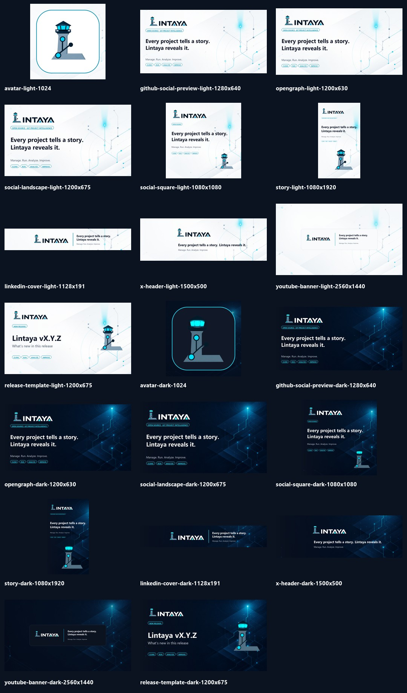

# Kit de redes sociales de Lintaya

Kit oficial v1.0 para presentar **Lintaya** en perfiles, publicaciones,
lanzamientos y enlaces compartidos. Todas las piezas existen en versión clara y
oscura y se generan a partir de los recursos canónicos de `assets/brand/`.



## Archivos incluidos

| Pieza | Dimensiones | Uso recomendado |
|---|---:|---|
| Avatar | 1024 × 1024 | GitHub, LinkedIn, X, YouTube, comunidad |
| GitHub social preview | 1280 × 640 | Imagen social del repositorio u organización |
| Open Graph | 1200 × 630 | Vista previa al compartir la web |
| Publicación horizontal | 1200 × 675 | LinkedIn, X, Mastodon, blog y anuncios |
| Publicación cuadrada | 1080 × 1080 | LinkedIn, Instagram y anuncios cuadrados |
| Historia vertical | 1080 × 1920 | Instagram Stories, Reels y Shorts |
| Portada de LinkedIn | 1128 × 191 | Página de empresa; izquierda reservada al avatar |
| Cabecera de X | 1500 × 500 | Perfil de X; evita contenido en la esquina inferior izquierda |
| Banner de YouTube | 2560 × 1440 | Canal; contenido dentro de zona segura 1546 × 423 |
| Plantilla de lanzamiento | 1200 × 675 | Anuncios de versiones y novedades |

Los archivos finales están organizados así:

```text
assets/social/
├── light/                 # veinte piezas claras/oscuras, diez por tema
├── dark/
├── source/
│   ├── background-light.png
│   └── background-dark.png
└── lintaya-social-kit-preview.jpg
```

## Copys aprobados

### Eslogan

> **Every project tells a story. Lintaya reveals it.**

### Descriptor de campaña

> **Manage. Run. Analyze. Improve.**

### Presentación extendida

> Manage, run, and understand projects from GitHub, GitLab, Bitbucket, and beyond.

### Hashtags sugeridos

`#Lintaya` `#OpenSource` `#Git` `#DevTools` `#CodeQuality`

No se recomienda llenar cada publicación con todos los hashtags. Usar entre dos
y cuatro según la comunidad y el contenido.

## Plantilla de lanzamiento

La imagen `release-template` se genera a partir de una plantilla interna con
dos variables editables:

```python
RELEASE_VERSION = "vX.Y.Z"
RELEASE_TITLE = "What’s new in this release"
```

La herramienta de generación y sus fuentes de trabajo se conservan fuera del
árbol público; las imágenes finales del kit sí forman parte de este directorio.

## Reglas de uso

- Usar la variante clara sobre superficies claras y la oscura sobre superficies
  oscuras.
- No mover, recolorear ni reconstruir el logotipo dentro de las piezas.
- Mantener textos importantes dentro de las zonas seguras de cada plataforma.
- No añadir púrpura, magenta o degradados ajenos a la paleta de Lintaya.
- Para una publicación específica puede cambiarse el título, pero se conservan
  tipografía, márgenes, fondo, atalaya y acento cian.
- Exportar como PNG para textos nítidos; usar JPG al 88–92 % solo cuando la
  plataforma imponga un límite de peso.
- Incluir en el texto alternativo una descripción funcional, por ejemplo:
  “Lintaya, plataforma open source para administrar, ejecutar y analizar
  proyectos Git”.

## Open Graph en producción

Al desplegar la web, configura una URL absoluta para la pieza Open Graph:

```html
<meta property="og:title" content="Lintaya" />
<meta property="og:description" content="Every project tells a story. Lintaya reveals it." />
<meta property="og:image" content="https://TU-DOMINIO/assets/social/dark/opengraph-dark-1200x630.png" />
<meta name="twitter:card" content="summary_large_image" />
```

No se añadió una URL ficticia al producto porque el dominio público definitivo
todavía no está definido.

## Origen visual

Las dos texturas base fueron creadas para Lintaya mediante el generador integrado
de imágenes: red de ramas Git, nodos, planos de observación y luz cian, con el
detalle concentrado a la derecha para dejar una zona de lectura limpia. Los
logotipos y todos los textos se componen después mediante el script para asegurar
ortografía, tamaños y consistencia.
