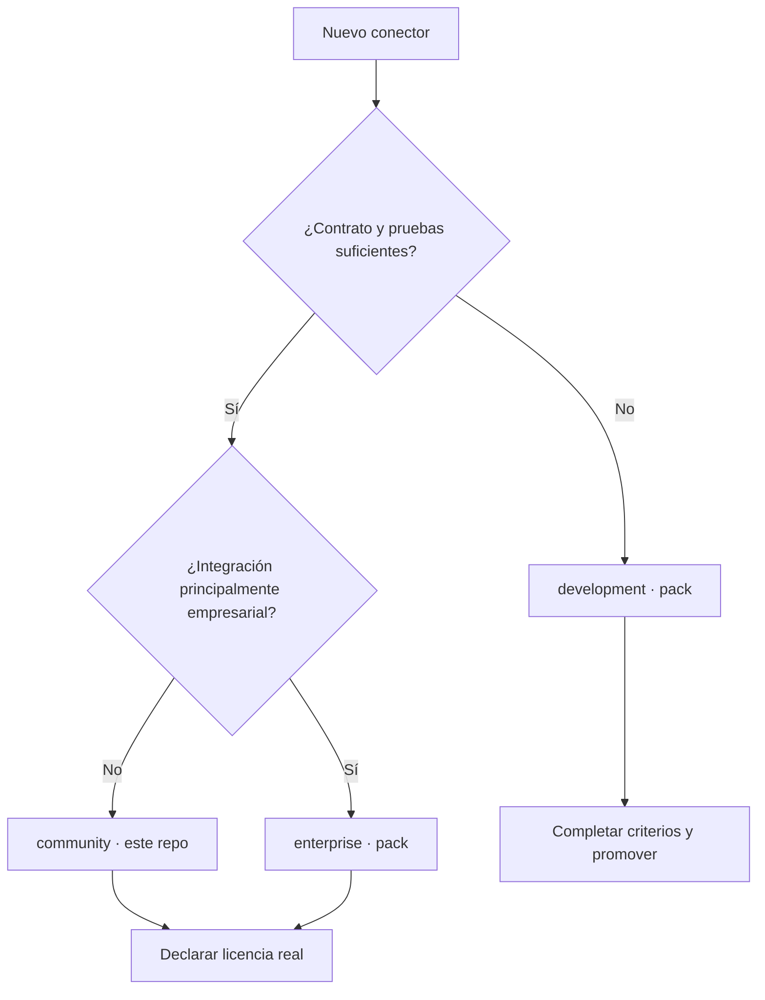

# Guía para desarrollar conectores de Lintaya

[English](DEVELOPMENT_GUIDE.md) | Español

Estado: contrato interno obligatorio para conectores nuevos.

Implementaciones de referencia:

- `server/connectors/community/github/`
- `server/connectors/community/gitlab/`

Para un recorrido completo desde una carpeta vacía hasta el auto-registro,
consultar [`EXAMPLE_PROVIDER_GUIDE.md`](EXAMPLE_PROVIDER_GUIDE.md).

Esta guía define cómo clasificar, nombrar, diseñar, implementar, probar y
documentar un conector. El objetivo es que un nuevo proveedor no obligue a
inventar otra arquitectura ni introduzca secretos, nombres de clientes o
comportamientos visuales incompatibles.

## 1. Antes de escribir código

Responder y documentar estas preguntas:

1. ¿Qué producto o protocolo integra?
2. ¿Quién puede utilizarlo y en qué edición aparece?
3. ¿Qué operaciones remotas necesita?
4. ¿Qué datos lee, escribe o ejecuta?
5. ¿Qué credenciales requiere?
6. ¿Admite nube, self-hosted o ambos?
7. ¿Qué límites, paginación y rate limits tiene la API?
8. ¿Qué capacidades normalizadas entregará a Lintaya?
9. ¿Cómo se prueba sin depender de una cuenta externa real?
10. ¿Cuál es su lifecycle inicial y qué falta para promoverlo?

Si estas respuestas no están claras, el conector comienza en `development`.

## 2. Clasificación del producto

`tier`, `lifecycle`, `license` y nivel de confianza son conceptos diferentes.
Nunca deben inferirse uno a partir de otro.

### Community (`community/`, en este repositorio)

Usar cuando:

- la integración tiene utilidad general para desarrolladores o equipos;
- forma parte de la experiencia abierta de Lintaya;
- puede mantenerse y probarse públicamente;
- no depende exclusivamente de un módulo comercial de Lintaya.

Ejemplos actuales: GitHub, GitLab, Bitbucket, Plane, Outline y Portainer.

Las implementaciones de referencia completas están en
`server/connectors/community/github/`, `gitlab/` y `bitbucket/`. Antes de crear
un cuarto proveedor SCM, comparar sus contratos de cliente, rutas, esquema y
pruebas.

> **Dónde vive cada tier.** Este repositorio solo entrega `community/`. Los
> tiers `enterprise` y `development` se distribuyen en su propio repositorio —
> el *connector pack* — que se instala en `~/.lintaya/connectors/` (ADR-014
> Fase 3). Un conector de esos tiers no se escribe aquí: se escribe allá, con
> las mismas reglas de este documento salvo las que dependen de la carpeta.

### Enterprise (`enterprise`)

Usar cuando:

- integra productos orientados principalmente a infraestructura empresarial;
- requiere operación, gobierno o soporte típicos de organizaciones grandes;
- su experiencia se presenta en el catálogo como “Empresarial”.

Ejemplos actuales: UCS Manager, vCenter y Qportal — los tres en el pack.

`enterprise` no significa automáticamente cerrado o de pago. Un conector que
vive en este repositorio público conserva la licencia declarada en su manifiesto.
Un módulo propietario futuro debe distribuirse fuera del núcleo público y
declarar su licencia real.

### Development (`development`)

Usar cuando:

- el contrato del proveedor todavía cambia;
- faltan pruebas críticas o manejo de errores;
- la experiencia es experimental;
- se necesita feedback antes de prometer compatibilidad.

Ejemplos actuales: Outlook, Outlook local, Lintaya remote y Anthropic — los
cuatro en el pack.

La UI lo muestra como “En desarrollo”. No debe presentarse como producción ni
como opción empresarial estable. Promoverlo a `community` es moverlo del pack a
`server/connectors/community/` de este repositorio, conservando su ID genérico
y cambiando `tier` en el manifiesto — con la consecuencia de que a partir de
ahí se distribuye públicamente.

### Árbol de decisión



## 3. Naming obligatorio

### ID y carpeta

- minúsculas y kebab-case: `^[a-z][a-z0-9-]*$`;
- nombre del producto, proveedor o protocolo;
- estable a través de ambientes e instalaciones;
- igual en carpeta, manifiesto, rutas, claves KV y logs.

Correctos:

- `github`
- `gitlab`
- `bitbucket`
- `vcenter`
- `ucsm`

Incorrectos:

- `vc-mex`: contiene ubicación;
- `gitlab-prod`: contiene ambiente;
- `customer-a-vcenter`: contiene cliente;
- `new-connector`: no describe el producto;
- `github-v2`: la versión pertenece al manifiesto o contrato, no al ID.

### Display name

Usar la marca oficial legible: `GitHub`, `GitLab`, `UCS Manager`. No incluir
estado, edición, ambiente ni nombre de cliente. Esos datos se muestran mediante
badges o configuración separada.

### Datos de ejemplo

Fixtures, screenshots, documentación y pruebas nunca incluyen dominios,
usuarios, IPs, nombres de sitios o tokens reales. Usar `example.test`, IDs
ficticios y secretos claramente simulados.

## 4. Estructura de paquete

Todo conector nuevo debe usar `implementation.mode: "package"`.
`legacy` solo existe para migrar conectores históricos.

```text
server/connectors/<tier>/<connector-id>/
|-- manifest.json             # obligatorio
|-- config.schema.json        # obligatorio si requiere configuración
|-- index.js                  # entrada pública del paquete
|-- client.js                 # transporte y API del proveedor
|-- routes.js                 # lifecycle HTTP de Lintaya
|-- client.test.js            # pruebas del cliente/mapeo
|-- routes.test.js            # pruebas de contratos y secretos
|-- README.md                 # uso, permisos y límites
|-- mapper.js                 # opcional para mapeos grandes
`-- fixtures/                 # opcional; datos ficticios y pequeños
```

No se colocan archivos de un conector dentro de otra carpeta de proveedor. El
paquete no importa archivos privados de otro conector.

## 5. Manifiesto

El manifiesto valida contra `server/connectors/manifest.schema.json`.

```json
{
  "manifestVersion": 1,
  "id": "acme-scm",
  "displayName": "Acme SCM",
  "version": "0.1.0",
  "tier": "development",
  "lifecycle": "development",
  "license": "Apache-2.0",
  "capabilities": [
    "repositories.read",
    "commits.read"
  ],
  "implementation": {
    "mode": "package",
    "source": "index.js"
  }
}
```

`source` se resuelve contra una base que el registro anota al cargar: la raíz
del repositorio para un conector que se entrega aquí, y su propia carpeta para
uno instalado. Por eso un conector del pack escribe `"index.js"`, y uno de
`community/` escribe la ruta larga desde la raíz.

### Cuando el conector solo corre en un sistema

Un conector atado a una plataforma lo declara, y el registro lo respeta: no lo
monta en ninguna otra, no lo agenda para sync, y la tarjeta dice “No corre aquí”
con el texto de `requires` en vez de fingir que está desconectado.

```json
{
  "transport": "script",
  "os": ["win32"],
  "requires": "Outlook de escritorio instalado y con sesión iniciada en esta máquina"
}
```

Omití `os` salvo que el conector esté genuinamente atado: sin él corre en todas
partes, que es el caso de casi todos. `requires` se escribe en palabras sobre
las que alguien pueda actuar, porque es lo que va a leer quien vea la tarjeta.

### Reglas

- `tier` coincide con la carpeta padre **dentro de este repositorio**. En el
  pack el directorio es plano y esa comprobación no aplica: el manifiesto es la
  única fuente del tier.
- `version` sigue SemVer.
- `license` describe el código distribuido, no el plan comercial.
- `capabilities` contiene únicamente funciones implementadas y probadas.
- `source` es relativa —`"index.js"` en el pack, la ruta desde la raíz en
  `community/`— y nunca una ruta local absoluta.
- Un cambio incompatible requiere versión mayor y plan de migración.

### Vocabulario inicial de capacidades SCM

- `repositories.read`
- `repositories.clone`
- `commits.read`
- `pull-requests.read`
- `deployments.read`
- `workflows.read`

Una capacidad nueva debe documentarse antes de usarse y no duplicar otra con un
nombre diferente.

## 6. Lifecycle

| Lifecycle | Uso | Requisitos mínimos |
|---|---|---|
| `development` | experimento visible | manifiesto, README, sin promesa de estabilidad |
| `beta` | usable con contrato en evolución | config segura, tests, errores, límites documentados |
| `stable` | apto para uso soportado | contrato versionado, migraciones, observabilidad, matriz de compatibilidad |
| `deprecated` | retiro planificado | reemplazo, aviso, fecha y guía de migración |

Promover lifecycle requiere un cambio explícito de manifiesto y changelog. No se
promueve solo porque “funcionó una vez” contra una cuenta real.

## 7. Configuración y secretos

El archivo `config.schema.json` usa JSON Schema Draft 2020-12:

```json
{
  "$schema": "https://json-schema.org/draft/2020-12/schema",
  "$id": "https://lintaya.dev/schemas/connectors/acme-scm-config-v1.json",
  "title": "Acme SCM connector configuration",
  "type": "object",
  "additionalProperties": false,
  "required": ["baseUrl", "token"],
  "properties": {
    "baseUrl": {
      "type": "string",
      "format": "uri"
    },
    "token": {
      "type": "string",
      "minLength": 1,
      "writeOnly": true,
      "x-lintaya-secret": true
    }
  }
}
```

### Reglas de seguridad

- Los secretos son `writeOnly` y `x-lintaya-secret: true`.
- `GET /config` devuelve `hasToken`, nunca el valor de `token`.
- Logs, errores, status, respuestas y fixtures redactan credenciales.
- No guardar tokens en `localStorage`, query strings, nombres de archivo o Git.
- No imprimir bodies o headers de autenticación.
- Validar protocolo y URL antes de guardar.
- TLS inseguro nunca es el default de un conector nuevo; si es imprescindible,
  debe ser opt-in, visible, documentado y probado.
- La configuración debe migrar de forma compatible al agregar campos.

El SDK actual filtra respuestas y logs, pero el cifrado en vault todavía está en
desarrollo. Un conector no debe crear almacenamiento secreto alternativo.

## 8. Uso del Connector SDK

El SDK es la única superficie compartida que un conector puede usar; nunca los
internals de `server/core`. **Llega en el contexto que el host entrega a
`register()`, no por un `require` relativo.**

Esa distinción no es estilo. Un conector instalado bajo
`LINTAYA_CONNECTORS_DIR` resuelve `require("../../sdk")` contra ese directorio
y no lo encuentra; y traerse una copia del SDK sería peor que la ruta rota,
porque el SDK es la fachada del secret store del proceso — una segunda copia
construiría un segundo almacén y el conector leería secretos que el host nunca
escribió, en silencio.

```js
function registerAcmeRoutes(options) {
  // El fallback solo se evalúa dentro del repositorio y en pruebas, donde la
  // ruta sí resuelve. Fuera, el contexto siempre trae el SDK.
  const { buildHttpUrl, createConnectorStore, requestJson } =
    options.sdk || require("../../sdk");
  const { app, requireAuth, kvGet, kvSet } = options;
  // …
}
```

Lo mismo aplica a cualquier dependencia del host: `express`, por ejemplo, viaja
en el contexto por la misma razón. Y si el conector necesita el SDK en un
archivo que no es el de rutas — un `client.js`, digamos — se lo pasas hacia
abajo en las opciones que ese archivo ya recibe, en vez de volver a requerirlo.

En las pruebas, pasa el SDK igual que lo pasa producción. Un harness que
entrega otra cosa es exactamente cómo un defecto se queda invisible:

```js
const harness = createRouteHarness(registerAcmeRoutes, {
  setup: () => ({ defaults: { sdk: require("../../sdk") } }),
});
```

El resto del cliente se escribe igual que siempre:

```js
function acmeRequest(baseUrl, token, path, method = "GET", body = null) {
  return requestJson({
    baseUrl,
    path,
    method,
    body,
    headers: {
      Authorization: `Bearer ${token}`,
      Accept: "application/json",
      "User-Agent": "lintaya",
    },
  });
}
```

### Reglas de cliente

- Sin red, timers, procesos ni escritura al importar el módulo.
- Timeout obligatorio y cancelación cuando el flujo lo permita.
- Errores de auth, rate limit, HTTP, timeout y red usan códigos normalizados.
- Preservar base paths de instalaciones self-hosted.
- Paginación acotada y sin duplicar elementos.
- Concurrencia acotada para no disparar rate limits.
- Respuestas grandes tienen límites explícitos.
- Retry solo para operaciones idempotentes y con backoff.
- No ejecutar redirects de autenticación de forma implícita.
- No desactivar TLS globalmente.
- Los métodos que escriben remotamente deben declararlo mediante una acción;
  las acciones destructivas solicitan aprobación humana.

### Mutaciones remotas y Approval Center — regla no negociable

Antes de implementar un conector, documentar una tabla con cada operación
remota, su efecto (`read`, `write` o `destructive`), sus parámetros y si es
reversible. **Toda mutación remota** se registra en `actions.js` mediante el
Action Registry con `inputSchema`, `outputSchema`, handler y efecto explícito.

- Un handler `destructive` es el único lugar que puede llamar la operación
  destructiva del proveedor. El primer intento devuelve `pending-approval`;
  solo una persona local puede resolver la solicitud exacta en Approval Center.
- No registrar una ruta HTTP que emita `DELETE`, purge, revoke, overwrite o un
  equivalente irreversible de forma directa. Si se conserva un endpoint legacy,
  este únicamente llama `executeAction(...)`, devuelve `202` mientras espera y
  falla cerrado con `503` si el centro no está disponible.
- `write` no significa automáticamente destructivo: justificar que es
  reversible o recuperable en el README. Si la reversibilidad es incierta,
  clasificar como `destructive`.
- Añadir pruebas de que la primera solicitud destructiva no toca al proveedor,
  que el endpoint legacy delega, y que no hay ejecución sin configuración ni
  con Approval Center indisponible.

Usar como referencias `outline.delete-document` y `plane.delete-issue`. La
prueba de inventario en `server/core/actions/bootstrap.test.js` se actualiza en
el mismo cambio para que un nuevo efecto destructivo no pase desapercibido.

## 9. Modelos normalizados

Un conector adapta el proveedor a Lintaya; la UI no debe conocer campos privados
de cada API para las operaciones comunes.

Modelo mínimo de repositorio SCM:

```js
{
  id,
  name,
  path,
  webUrl,
  cloneUrl,
  description,
  defaultBranch,
  group,
  topics,
  visibility,
  language,
  lastActivityAt,
  pipelineStatus,
  openMRs,
  lastCommit,
  deploymentCount,
}
```

Reglas:

- fechas ISO-8601;
- IDs estables y serializables;
- `null` para desconocido, no texto engañoso;
- estados del proveedor se mapean al vocabulario común cuando exista;
- conservar `webUrl` para regresar a la fuente;
- un campo faltante no debe romper toda la sincronización;
- el mapeo tiene fixtures y pruebas independientes.

## 10. Rutas lifecycle

Contrato actual compatible:

- `GET /api/connectors/<id>/config`
- `POST /api/connectors/<id>/config`
- `POST /api/connectors/<id>/test`
- `POST /api/connectors/<id>/sync`

Un router se registra mediante dependencias explícitas:

```js
function registerAcmeRoutes({
  app,
  requireAuth,
  kvGet,
  kvSet,
  connectorLog,
  request = acmeRequest,
  sync = syncAcme,
  now = Date.now,
}) {
  // Register routes without opening ports or starting background work.
}
```

### Contratos

- Todas las rutas, excepto metadata pública explícita, usan `requireAuth`.
- `test` es read-only respecto del proveedor.
- `sync` no modifica datos remotos.
- Configuración inválida devuelve 400.
- Proveedor no configurado devuelve `connector-not-configured`.
- Fallo remoto se normaliza y no expone credenciales.
- La respuesta existente se conserva durante migraciones.
- El paquete no llama `listen()` ni inicia schedulers.

Durante la migración actual se permite una importación del paquete desde el
composition root de `server.js`. Toda la lógica del proveedor debe vivir en su
paquete. Cuando el registro dinámico esté listo, un conector nuevo no deberá
editar `server.js`.

### Rutas que escriben — auditoría obligatoria

`test` y `sync` ya quedan cubiertos por el logger del SDK
(`createConnectorLogger`, sección 8). **Cualquier otra ruta que cambie estado**
(crear, editar o borrar datos del proveedor) se implementa primero como acción
del Action Registry, que ya valida schemas, aplica el gate de aprobación y
registra su resultado en **Logs → Conectores**. Una ruta REST heredada no
reimplementa esa lógica: delega a la acción. `auditWrite` queda reservado para
escrituras locales que no sean operaciones del proveedor.

```js
app.post("/api/connectors/:provider/projects/:id/algo-que-escribe", requireAuth,
  auditWrite({ provider: (req) => req.params.provider, action: "Descripción corta" }),
  async (req, res) => {
    // ... la ruta hace lo suyo y llama res.json(...) / res.status(n).json(...) como siempre.
    // Opcional: res.locals.auditMessage / res.locals.auditMeta ANTES de responder,
    // para un mensaje o detalle más rico que el default.
  });
```

El wrapper intercepta la respuesta real que ya mandás y registra `ok`/`err`
solo — el endpoint (`req.method` + `req.originalUrl`) se captura solo. **No
hace falta acordarse de loguear en cada `return res.json(...)` temprano** (404,
400, etc.): como el wrapper corre antes que el handler, hasta esos casos
quedan auditados sin tocarlos. Esto existe porque `/prepare-env` se instrumentó
a mano después de haber lanzado el resto de rutas de repos y quedó afuera —
la lección fue que instrumentar a mano no escala; el wrapper es el estándar
para que una ruta nueva no pueda quedar sin loguear por olvido.

## 11. Diseño visual del catálogo y configuración

El logo del proveedor, tier, lifecycle y estado de conexión comunican cosas
diferentes y no deben fusionarse en un solo icono.

### Tarjeta del conector

- Logo oficial o icono neutral del producto.
- Nombre y tipo legibles.
- Badge de tier con icono definido por Lintaya:
  - personas: Community;
  - edificio: Enterprise;
  - reloj: Development.
- Badge de estado separado: connected, warning, error, offline.
- Lifecycle visible en detalle cuando no sea `stable`.
- Acciones consistentes: Configure, Test, Sync, Documentation.

Los tres tiers usan actualmente un gris neutral para evitar ruido visual. No se
asignan colores de marca diferentes a Community/Enterprise/Development. El
color del proveedor puede vivir en su logo, no en el badge del tier.

### Formulario

- Labels visibles, no solo placeholders.
- Descripción y enlace a cómo obtener credenciales.
- Campos secretos con tipo password y opción temporal de mostrar/ocultar.
- URL y modo cloud/self-hosted claramente diferenciados.
- Advertencias visibles para TLS inseguro o permisos amplios.
- Botones Save, Test y Cancel con estados loading y error.
- No mostrar tokens guardados; solo indicar su presencia.
- Errores junto al campo y resumen accesible.

### Responsive y accesibilidad

- Sin overflow horizontal a 393 px.
- Una columna en móvil; acciones críticas no quedan fuera de pantalla.
- Modal se convierte en página o sheet si el formulario es largo.
- Áreas táctiles de al menos 44 px.
- Navegación completa por teclado y foco visible.
- Tier y status tienen texto/icono; el color no es el único indicador.
- Compatible con modo claro, oscuro y `prefers-reduced-motion`.
- Nombres largos usan ellipsis con tooltip accesible.

### Agentic Workspace

En el futuro workspace, un conector usa:

- Context Explorer para seleccionar cuenta, workspace o alcance;
- Workbench para configuración y capacidades;
- Inspector para diagnóstico y permisos;
- Dock para request logs redactados;
- Activity para Test, Sync y aprobaciones de escrituras remotas.

Nunca mostrar una cadena de pensamiento privada. Mostrar acciones, evidencia,
errores normalizados y recomendaciones verificables.

## 12. Pruebas obligatorias

### Manifiesto

- [ ] El registry carga el paquete.
- [ ] Tier coincide con carpeta.
- [ ] ID es único y genérico.
- [ ] SemVer, lifecycle, licencia y capacidades son válidos.
- [ ] `implementation.source` apunta a la entrada real.

### Cliente

- [ ] Preserva base path self-hosted.
- [ ] Envía autenticación y headers correctos sin registrarlos.
- [ ] Normaliza auth, rate limit, HTTP, timeout, cancelación y red.
- [ ] Pagina sin pérdida ni duplicados.
- [ ] Mapea fixtures al modelo común.
- [ ] Aplica límites de concurrencia y tamaño.

### Rutas

- [ ] Config nunca devuelve secretos.
- [ ] Config valida y normaliza inputs.
- [ ] Test persiste status seguro.
- [ ] Errores redactan secretos en response, status y logs.
- [ ] Sync conserva el contrato KV y HTTP.
- [ ] Dependencias, tiempo y red son inyectables.
- [ ] Las pruebas no abren puerto, SQLite ni red externa.
- [ ] Cada mutación remota tiene una acción con schemas y efecto explícito.
- [ ] Una acción destructiva devuelve `pending-approval` sin llamar al proveedor.
- [ ] Ninguna ruta destructiva directa evita el Action Registry; cualquier alias legacy delega y falla cerrado.

### UI

- [ ] Tarjeta muestra logo, tier y status por separado.
- [ ] Cada Connection se representa como artículo/tarjeta dentro de una lista
  etiquetada; abrir detalle es un botón nativo, no un `div` clickable.
- [ ] Formulario funciona con teclado y cada input, select y textarea tiene
  un `label` visible asociado.
- [ ] Botones solo-ícono tienen `aria-label`; selectores usan `aria-pressed`
  cuando tienen un estado seleccionado.
- [ ] Errores que requieren atención usan `role="alert"`; loading y cambios de
  status se anuncian sin depender solamente de color o animación.
- [ ] Diálogos tienen `role="dialog"`, `aria-modal`, nombre accesible, Escape,
  foco inicial, focus trap y retorno al control que los abrió.
- [ ] `data-lintaya-*` solo describe una entidad, acción o superficie durable;
  no contiene secretos, prompts, IDs privados ni estado serializado, y nunca
  constituye una API.
- [ ] Estados loading, empty, success y error están cubiertos.
- [ ] 393, 768, 1024 y 1440 px no presentan solapamientos.
- [ ] Modo claro y oscuro conservan contraste.

### Agentes y contrato de automatización

- [ ] El manifest/registry es dueño del ConnectorType; la configuración,
  secretos, status, datos sincronizados y nombre pertenecen a cada Connection.
- [ ] Un agente no necesita ni intenta extraer información o capacidad de
  escritura desde HTML, clases CSS, textos visibles o `data-*`.
- [ ] Las lecturas y escrituras para agentes se exponen mediante endpoints
  autenticados, schemas versionados y, cuando exista una acción, el Action
  Registry; los permisos no se infieren desde la UI.
- [ ] Antes de crear o editar datos para una Connection, el agente consulta
  `GET /api/connectors/:id/ai-context`; ese contexto del usuario prevalece
  sobre el README del paquete si hay conflicto.
- [ ] Toda escritura iniciada por agente envía `X-Actor`, se audita y respeta
  la clasificación `read`, `write` o `destructive` y su política de aprobación.
- [ ] Ninguna superficie pública de descubrimiento devuelve config almacenada,
  hostnames internos, datos de usuario, prompts editables o secretos.

Comandos mínimos:

```bash
cd server
npm run test:connectors
npm run check
```

Además, desde la raíz:

```bash
node scripts/check-json.mjs
node scripts/check-js-syntax.mjs
node scripts/check-secrets.mjs
```

## 13. README obligatorio del conector

Debe incluir:

1. propósito y productos compatibles;
2. tier, lifecycle y licencia;
3. cloud/self-hosted y versiones probadas;
4. permisos mínimos de la credencial;
5. campos de configuración;
6. rutas y capacidades;
7. límites, paginación y rate limits;
8. modelo de datos producido;
9. comportamiento TLS y red;
10. cómo ejecutar pruebas;
11. limitaciones conocidas;
12. proceso de soporte y seguridad.

## 14. Anti-patrones rechazados

- Añadir lógica nueva del proveedor directamente a `server.js`.
- Copiar el cliente HTTP de otro conector.
- Hardcodear tier en la UI como única fuente de verdad.
- Usar nombres de cliente, ciudad, ambiente o hostname como ID.
- Devolver config completa al navegador.
- Registrar headers, bodies o URLs con secretos.
- Capturar errores con `catch {}` en la operación principal sin observabilidad.
- Sincronizar un número ilimitado de páginas o proyectos.
- Ejecutar shell para una operación disponible por API.
- Desactivar validación TLS por defecto.
- Declarar capacidades no implementadas.
- Llamar `listen()`, crear timers o hacer red al importar el paquete.
- Diseñar un formulario solo para desktop.
- Mezclar logo del proveedor con el icono de tier o estado.

## 15. Flujo de contribución

```mermaid
flowchart LR
    IDEA["Propuesta"] --> CLASSIFY["Tier y lifecycle"]
    CLASSIFY --> MANIFEST["Manifest + config schema"]
    MANIFEST --> CLIENT["Client + mapper"]
    CLIENT --> ROUTES["Lifecycle routes"]
    ROUTES --> TESTS["Contract tests"]
    TESTS --> UI["Catalog + form"]
    UI --> DOCS["README + changelog"]
    DOCS --> REVIEW["Security/design review"]
    REVIEW --> RELEASE["Beta or stable"]
```



Antes de solicitar revisión, completar
[`REVIEW_CHECKLIST.md`](REVIEW_CHECKLIST.md).
