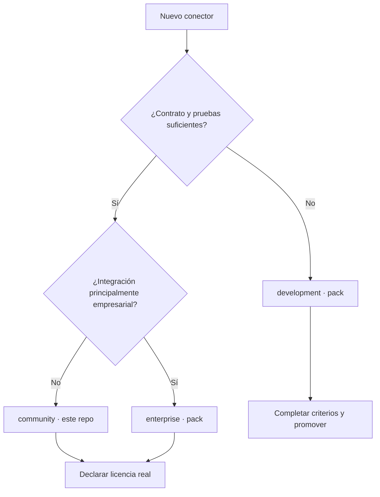

# Guide to developing Lintaya connectors

English | [Español](DEVELOPMENT_GUIDE.es.md)

Status: mandatory internal contract for new connectors.

Reference implementations:

- `server/connectors/community/github/`
- `server/connectors/community/gitlab/`

For a full walkthrough from an empty folder to auto-registration, see
[`EXAMPLE_PROVIDER_GUIDE.md`](EXAMPLE_PROVIDER_GUIDE.md).

This guide defines how to classify, name, design, implement, test and document a
connector. The goal is that a new provider does not force anyone to invent
another architecture, and does not introduce secrets, customer names or
incompatible visual behaviour.

## 1. Before writing code

Answer and document these questions:

1. What product or protocol does it integrate?
2. Who can use it, and in which edition does it appear?
3. What remote operations does it need?
4. What data does it read, write or execute?
5. What credentials does it require?
6. Does it support cloud, self-hosted, or both?
7. What limits, pagination and rate limits does the API have?
8. What normalized capabilities will it hand to Lintaya?
9. How is it tested without depending on a real external account?
10. What is its initial lifecycle, and what is missing to promote it?

If these answers are not clear, the connector starts in `development`.

## 2. Classifying the product

`tier`, `lifecycle`, `license` and level of trust are different concepts. One
must never be inferred from another.

### Community (`community/`, in this repository)

Use when:

- the integration is generally useful to developers or teams;
- it is part of Lintaya's open experience;
- it can be maintained and tested publicly;
- it does not depend exclusively on a commercial Lintaya module.

Current examples: GitHub, GitLab, Bitbucket, Plane, Outline and Portainer.

The complete reference implementations are in
`server/connectors/community/github/`, `gitlab/` and `bitbucket/`. Before
creating a fourth SCM provider, compare their client contracts, routes, schema
and tests.

> **Where each tier lives.** This repository ships `community/` only. The
> `enterprise` and `development` tiers are distributed in their own repository —
> the *connector pack* — which installs into `~/.lintaya/connectors/` (ADR-014
> Phase 3). A connector in those tiers is not written here: it is written there,
> under the same rules as this document except those that depend on the folder.

### Enterprise (`enterprise`)

Use when:

- it integrates products aimed primarily at enterprise infrastructure;
- it requires the operation, governance or support typical of large
  organizations;
- its experience is presented in the catalog as "Enterprise".

Current examples: UCS Manager, vCenter and Qportal — all three in the pack.

`enterprise` does not automatically mean closed or paid. A connector living in
this public repository keeps the license declared in its manifest. A future
proprietary module must be distributed outside the public core and declare its
real license.

### Development (`development`)

Use when:

- the provider's contract still changes;
- critical tests or error handling are missing;
- the experience is experimental;
- feedback is needed before promising compatibility.

Current examples: Outlook, Outlook local, Lintaya remote and Anthropic — all
four in the pack.

The UI shows it as "In development". It must not be presented as production, nor
as a stable enterprise option. Promoting it to `community` means moving it from
the pack to `server/connectors/community/` in this repository, keeping its
generic ID and changing `tier` in the manifest — with the consequence that from
then on it is distributed publicly.

### Decision tree



## 3. Mandatory naming

### ID and folder

- lowercase and kebab-case: `^[a-z][a-z0-9-]*$`;
- the name of the product, provider or protocol;
- stable across environments and installations;
- identical in folder, manifest, routes, KV keys and logs.

Correct:

- `github`
- `gitlab`
- `bitbucket`
- `vcenter`
- `ucsm`

Incorrect:

- `vc-mex`: contains a location;
- `gitlab-prod`: contains an environment;
- `customer-a-vcenter`: contains a customer;
- `new-connector`: does not describe the product;
- `github-v2`: the version belongs to the manifest or contract, not the ID.

### Display name

Use the official readable brand: `GitHub`, `GitLab`, `UCS Manager`. Do not
include status, edition, environment or customer name. Those are shown through
badges or separate configuration.

### Example data

Fixtures, screenshots, documentation and tests never include real domains,
usernames, IPs, site names or tokens. Use `example.test`, fictional IDs and
clearly simulated secrets.

## 4. Package structure

Every new connector must use `implementation.mode: "package"`. `legacy` exists
only to migrate historical connectors.

```text
server/connectors/<tier>/<connector-id>/
|-- manifest.json             # obligatorio
|-- config.schema.json        # obligatorio si requiere configuración
|-- index.js                  # entrada pública del paquete
|-- client.js                 # transporte y API del proveedor
|-- routes.js                 # lifecycle HTTP de Lintaya
|-- client.test.js            # pruebas del cliente/mapeo
|-- routes.test.js            # pruebas de contratos y secretos
|-- README.md                 # uso, permisos y límites
|-- mapper.js                 # opcional para mapeos grandes
`-- fixtures/                 # opcional; datos ficticios y pequeños
```

One connector's files are never placed inside another provider's folder. A
package does not import another connector's private files.

## 5. Manifest

The manifest validates against `server/connectors/manifest.schema.json`.

```json
{
  "manifestVersion": 1,
  "id": "acme-scm",
  "displayName": "Acme SCM",
  "version": "0.1.0",
  "tier": "development",
  "lifecycle": "development",
  "license": "Apache-2.0",
  "capabilities": [
    "repositories.read",
    "commits.read"
  ],
  "implementation": {
    "mode": "package",
    "source": "index.js"
  }
}
```

`source` resolves against a base the registry notes while loading: the
repository root for a connector shipped here, and its own folder for an
installed one. That is why a connector in the pack writes `"index.js"`, and one
in `community/` writes the long path from the root.

### When the connector only runs on one system

A connector tied to a platform declares it, and the registry honours that: it
does not mount it anywhere else, does not schedule it for sync, and the card
says "Does not run here" with the text from `requires`, instead of pretending it
is disconnected.

```json
{
  "transport": "script",
  "os": ["win32"],
  "requires": "Outlook de escritorio instalado y con sesión iniciada en esta máquina"
}
```

Omit `os` unless the connector is genuinely tied: without it, it runs
everywhere, which is the case for almost all of them. `requires` is written in
words someone can act on, because it is what whoever sees the card will read.

### Rules

- `tier` matches the parent folder **inside this repository**. In the pack the
  directory is flat and that check does not apply: the manifest is the only
  source of the tier.
- `version` follows SemVer.
- `license` describes the distributed code, not the commercial plan.
- `capabilities` contains only implemented and tested functions.
- `source` is relative — `"index.js"` in the pack, the path from the root in
  `community/` — and never an absolute local path.
- An incompatible change requires a major version and a migration plan.

### Initial SCM capability vocabulary

- `repositories.read`
- `repositories.clone`
- `commits.read`
- `pull-requests.read`
- `deployments.read`
- `workflows.read`

A new capability must be documented before it is used, and must not duplicate
another under a different name.

## 6. Lifecycle

| Lifecycle | Use | Minimum requirements |
|---|---|---|
| `development` | visible experiment | manifest, README, no promise of stability |
| `beta` | usable with an evolving contract | safe config, tests, errors, documented limits |
| `stable` | fit for supported use | versioned contract, migrations, observability, compatibility matrix |
| `deprecated` | planned retirement | replacement, notice, date and migration guide |

Promoting a lifecycle requires an explicit manifest change and a changelog entry.
It is not promoted just because "it worked once" against a real account.

## 7. Configuration and secrets

`config.schema.json` uses JSON Schema Draft 2020-12:

```json
{
  "$schema": "https://json-schema.org/draft/2020-12/schema",
  "$id": "https://lintaya.dev/schemas/connectors/acme-scm-config-v1.json",
  "title": "Acme SCM connector configuration",
  "type": "object",
  "additionalProperties": false,
  "required": ["baseUrl", "token"],
  "properties": {
    "baseUrl": {
      "type": "string",
      "format": "uri"
    },
    "token": {
      "type": "string",
      "minLength": 1,
      "writeOnly": true,
      "x-lintaya-secret": true
    }
  }
}
```

### Security rules

- Secrets are `writeOnly` and `x-lintaya-secret: true`.
- `GET /config` returns `hasToken`, never the value of `token`.
- Logs, errors, status, responses and fixtures redact credentials.
- Do not store tokens in `localStorage`, query strings, file names or Git.
- Do not print authentication bodies or headers.
- Validate protocol and URL before saving.
- Insecure TLS is never a new connector's default; if it is unavoidable, it must
  be opt-in, visible, documented and tested.
- Configuration must migrate compatibly when fields are added.

The current SDK filters responses and logs, but vault encryption is still under
development. A connector must not create alternative secret storage.

## 8. Using the Connector SDK

The SDK is the only shared surface a connector may use; never the internals of
`server/core`. **It arrives in the context the host hands to `register()`, not
through a relative `require`.**

That distinction is not style. A connector installed under
`LINTAYA_CONNECTORS_DIR` resolves `require("../../sdk")` against that directory
and does not find it; and bringing along a copy of the SDK would be worse than
the broken path, because the SDK is the façade over the process's secret store —
a second copy would build a second store, and the connector would silently read
secrets the host never wrote.

```js
function registerAcmeRoutes(options) {
  // El fallback solo se evalúa dentro del repositorio y en pruebas, donde la
  // ruta sí resuelve. Fuera, el contexto siempre trae el SDK.
  const { buildHttpUrl, createConnectorStore, requestJson } =
    options.sdk || require("../../sdk");
  const { app, requireAuth, kvGet, kvSet } = options;
  // …
}
```

The same applies to any host dependency: `express`, for example, travels in the
context for the same reason. And if the connector needs the SDK in a file that
is not the routes file — a `client.js`, say — you pass it down through the
options that file already receives, instead of requiring it again.

In tests, pass the SDK the same way production passes it. A harness that hands
over something else is exactly how a defect stays invisible:

```js
const harness = createRouteHarness(registerAcmeRoutes, {
  setup: () => ({ defaults: { sdk: require("../../sdk") } }),
});
```

The rest of the client is written as always:

```js
function acmeRequest(baseUrl, token, path, method = "GET", body = null) {
  return requestJson({
    baseUrl,
    path,
    method,
    body,
    headers: {
      Authorization: `Bearer ${token}`,
      Accept: "application/json",
      "User-Agent": "lintaya",
    },
  });
}
```

### Client rules

- No network, timers, processes or writes on module import.
- Mandatory timeout, and cancellation when the flow allows it.
- Auth, rate limit, HTTP, timeout and network errors use normalized codes.
- Preserve the base paths of self-hosted installations.
- Bounded pagination with no duplicated items.
- Bounded concurrency, so rate limits are not triggered.
- Large responses have explicit limits.
- Retry only for idempotent operations, and with backoff.
- Do not follow authentication redirects implicitly.
- Do not disable TLS globally.
- Methods that write remotely must declare it through an action; destructive
  actions request human approval.

### Remote mutations and the Approval Center — a non-negotiable rule

Before implementing a connector, document a table with every remote operation,
its effect (`read`, `write` or `destructive`), its parameters, and whether it is
reversible. **Every remote mutation** is registered in `actions.js` through the
Action Registry with `inputSchema`, `outputSchema`, a handler and an explicit
effect.

- A `destructive` handler is the only place that may call the provider's
  destructive operation. The first attempt returns `pending-approval`; only a
  local person can resolve that exact request in the Approval Center.
- Do not register an HTTP route that issues `DELETE`, purge, revoke, overwrite
  or an irreversible equivalent directly. If a legacy endpoint is kept, it only
  calls `executeAction(...)`, returns `202` while it waits, and fails closed with
  `503` if the center is unavailable.
- `write` does not automatically mean destructive: justify in the README that it
  is reversible or recoverable. If reversibility is uncertain, classify it as
  `destructive`.
- Add tests proving that the first destructive request does not touch the
  provider, that the legacy endpoint delegates, and that there is no execution
  without configuration or with the Approval Center unavailable.

Use `outline.delete-document` and `plane.delete-issue` as references. The
inventory test in `server/core/actions/bootstrap.test.js` is updated in the same
change, so a new destructive effect cannot slip by unnoticed.

## 9. Normalized models

A connector adapts the provider to Lintaya; the UI must not know each API's
private fields for common operations.

Minimum SCM repository model:

```js
{
  id,
  name,
  path,
  webUrl,
  cloneUrl,
  description,
  defaultBranch,
  group,
  topics,
  visibility,
  language,
  lastActivityAt,
  pipelineStatus,
  openMRs,
  lastCommit,
  deploymentCount,
}
```

Rules:

- ISO-8601 dates;
- stable, serializable IDs;
- `null` for unknown, not misleading text;
- provider states map to the common vocabulary where one exists;
- keep `webUrl` so it is possible to go back to the source;
- a missing field must not break the whole synchronization;
- the mapping has its own fixtures and tests.

## 10. Lifecycle routes

Current compatible contract:

- `GET /api/connectors/<id>/config`
- `POST /api/connectors/<id>/config`
- `POST /api/connectors/<id>/test`
- `POST /api/connectors/<id>/sync`

A router is registered through explicit dependencies:

```js
function registerAcmeRoutes({
  app,
  requireAuth,
  kvGet,
  kvSet,
  connectorLog,
  request = acmeRequest,
  sync = syncAcme,
  now = Date.now,
}) {
  // Register routes without opening ports or starting background work.
}
```

### Contracts

- Every route, except explicit public metadata, uses `requireAuth`.
- `test` is read-only with respect to the provider.
- `sync` does not modify remote data.
- Invalid configuration returns 400.
- An unconfigured provider returns `connector-not-configured`.
- A remote failure is normalized and does not expose credentials.
- The existing response is preserved during migrations.
- The package neither calls `listen()` nor starts schedulers.

During the current migration, one import of the package from `server.js`'s
composition root is allowed. All provider logic must live in its package. Once
dynamic registration is ready, a new connector will not need to edit
`server.js`.

### Routes that write — auditing is mandatory

`test` and `sync` are already covered by the SDK's logger
(`createConnectorLogger`, section 8). **Any other route that changes state**
(creating, editing or deleting provider data) is implemented first as an Action
Registry action, which already validates schemas, applies the approval gate and
records its result in **Logs → Connectors**. A legacy REST route does not
reimplement that logic: it delegates to the action. `auditWrite` is reserved for
local writes that are not provider operations.

```js
app.post("/api/connectors/:provider/projects/:id/algo-que-escribe", requireAuth,
  auditWrite({ provider: (req) => req.params.provider, action: "Descripción corta" }),
  async (req, res) => {
    // ... la ruta hace lo suyo y llama res.json(...) / res.status(n).json(...) como siempre.
    // Opcional: res.locals.auditMessage / res.locals.auditMeta ANTES de responder,
    // para un mensaje o detalle más rico que el default.
  });
```

The wrapper intercepts the actual response you already send and records `ok`/`err`
only — the endpoint (`req.method` + `req.originalUrl`) is captured on its own.
**There is no need to remember to log at every early `return res.json(...)`**
(404, 400, and so on): since the wrapper runs before the handler, even those
cases are audited without being touched. This exists because `/prepare-env` was
instrumented by hand after the rest of the repo routes had shipped, and was left
out — the lesson was that instrumenting by hand does not scale; the wrapper is
the standard, so a new route cannot end up unlogged through forgetfulness.

## 11. Visual design of the catalog and configuration

The provider's logo, tier, lifecycle and connection status communicate different
things and must not be merged into a single icon.

### Connector card

- Official logo or a neutral product icon.
- Readable name and type.
- Tier badge with a Lintaya-defined icon:
  - people: Community;
  - building: Enterprise;
  - clock: Development.
- A separate status badge: connected, warning, error, offline.
- Lifecycle visible in the detail when it is not `stable`.
- Consistent actions: Configure, Test, Sync, Documentation.

All three tiers currently use a neutral grey, to avoid visual noise. Different
brand colours are not assigned to Community/Enterprise/Development. The
provider's colour may live in its logo, not in the tier badge.

### Form

- Visible labels, not placeholders alone.
- A description and a link to how to obtain credentials.
- Secret fields with type password and a temporary show/hide option.
- URL and cloud/self-hosted mode clearly distinguished.
- Visible warnings for insecure TLS or broad permissions.
- Save, Test and Cancel buttons with loading and error states.
- Do not show stored tokens; only indicate their presence.
- Errors beside the field, plus an accessible summary.

### Responsive and accessibility

- No horizontal overflow at 393 px.
- One column on mobile; critical actions do not end up off screen.
- The modal becomes a page or sheet if the form is long.
- Touch targets of at least 44 px.
- Full keyboard navigation and visible focus.
- Tier and status have text or an icon; colour is not the only indicator.
- Compatible with light mode, dark mode and `prefers-reduced-motion`.
- Long names use an ellipsis with an accessible tooltip.

### Agentic Workspace

In the future workspace, a connector uses:

- the Context Explorer to select an account, workspace or scope;
- the Workbench for configuration and capabilities;
- the Inspector for diagnostics and permissions;
- the Dock for redacted request logs;
- Activity for Test, Sync and approvals of remote writes.

Never show a private chain of thought. Show actions, evidence, normalized errors
and verifiable recommendations.

## 12. Mandatory tests

### Manifest

- [ ] The registry loads the package.
- [ ] Tier matches the folder.
- [ ] The ID is unique and generic.
- [ ] SemVer, lifecycle, license and capabilities are valid.
- [ ] `implementation.source` points at the real entry point.

### Client

- [ ] Preserves the self-hosted base path.
- [ ] Sends the correct authentication and headers without logging them.
- [ ] Normalizes auth, rate limit, HTTP, timeout, cancellation and network.
- [ ] Paginates with no loss and no duplicates.
- [ ] Maps fixtures to the common model.
- [ ] Applies concurrency and size limits.

### Routes

- [ ] Config never returns secrets.
- [ ] Config validates and normalizes inputs.
- [ ] Test persists a safe status.
- [ ] Errors redact secrets in the response, status and logs.
- [ ] Sync preserves the KV and HTTP contract.
- [ ] Dependencies, time and network are injectable.
- [ ] Tests open no port, no SQLite and no external network.
- [ ] Every remote mutation has an action with schemas and an explicit effect.
- [ ] A destructive action returns `pending-approval` without calling the provider.
- [ ] No direct destructive route bypasses the Action Registry; any legacy alias delegates and fails closed.

### UI

- [ ] The card shows logo, tier and status separately.
- [ ] Each Connection is represented as an article or card inside a labelled
  list; opening the detail is a native button, not a clickable `div`.
- [ ] The form works with the keyboard and every input, select and textarea has
  an associated visible `label`.
- [ ] Icon-only buttons have an `aria-label`; selectors use `aria-pressed` when
  they have a selected state.
- [ ] Errors needing attention use `role="alert"`; loading and status changes are
  announced without depending on colour or animation alone.
- [ ] Dialogs have `role="dialog"`, `aria-modal`, an accessible name, Escape,
  initial focus, a focus trap and return to the control that opened them.
- [ ] `data-lintaya-*` describes only a durable entity, action or surface; it
  contains no secrets, prompts, private IDs or serialized state, and never
  constitutes an API.
- [ ] Loading, empty, success and error states are covered.
- [ ] 393, 768, 1024 and 1440 px show no overlaps.
- [ ] Light and dark modes preserve contrast.

### Agents and the automation contract

- [ ] The manifest/registry owns the ConnectorType; configuration, secrets,
  status, synchronized data and name belong to each Connection.
- [ ] An agent neither needs nor attempts to extract information or write
  capability from HTML, CSS classes, visible text or `data-*`.
- [ ] Reads and writes for agents are exposed through authenticated endpoints,
  versioned schemas and, where an action exists, the Action Registry;
  permissions are not inferred from the UI.
- [ ] Before creating or editing data for a Connection, the agent consults
  `GET /api/connectors/:id/ai-context`; that user context prevails over the
  package's README if they conflict.
- [ ] Every agent-initiated write sends `X-Actor`, is audited, and respects the
  `read`, `write` or `destructive` classification and its approval policy.
- [ ] No public discovery surface returns stored config, internal hostnames, user
  data, editable prompts or secrets.

Minimum commands:

```bash
cd server
npm run test:connectors
npm run check
```

And from the root:

```bash
node scripts/check-json.mjs
node scripts/check-js-syntax.mjs
node scripts/check-secrets.mjs
```

## 13. Mandatory connector README

It must include:

1. purpose and compatible products;
2. tier, lifecycle and license;
3. cloud/self-hosted and tested versions;
4. minimum credential permissions;
5. configuration fields;
6. routes and capabilities;
7. limits, pagination and rate limits;
8. the data model produced;
9. TLS and network behaviour;
10. how to run the tests;
11. known limitations;
12. the support and security process.

## 14. Rejected anti-patterns

- Adding new provider logic directly to `server.js`.
- Copying another connector's HTTP client.
- Hardcoding the tier in the UI as the only source of truth.
- Using a customer, city, environment or hostname as the ID.
- Returning the full config to the browser.
- Logging headers, bodies or URLs containing secrets.
- Catching errors with `catch {}` in the main operation with no observability.
- Synchronizing an unlimited number of pages or projects.
- Shelling out for an operation available through the API.
- Disabling TLS validation by default.
- Declaring capabilities that are not implemented.
- Calling `listen()`, creating timers or doing network work on package import.
- Designing a desktop-only form.
- Mixing the provider's logo with the tier or status icon.

## 15. Contribution flow

```mermaid
flowchart LR
    IDEA["Propuesta"] --> CLASSIFY["Tier y lifecycle"]
    CLASSIFY --> MANIFEST["Manifest + config schema"]
    MANIFEST --> CLIENT["Client + mapper"]
    CLIENT --> ROUTES["Lifecycle routes"]
    ROUTES --> TESTS["Contract tests"]
    TESTS --> UI["Catalog + form"]
    UI --> DOCS["README + changelog"]
    DOCS --> REVIEW["Security/design review"]
    REVIEW --> RELEASE["Beta or stable"]
```



Before requesting review, complete
[`REVIEW_CHECKLIST.md`](REVIEW_CHECKLIST.md).
